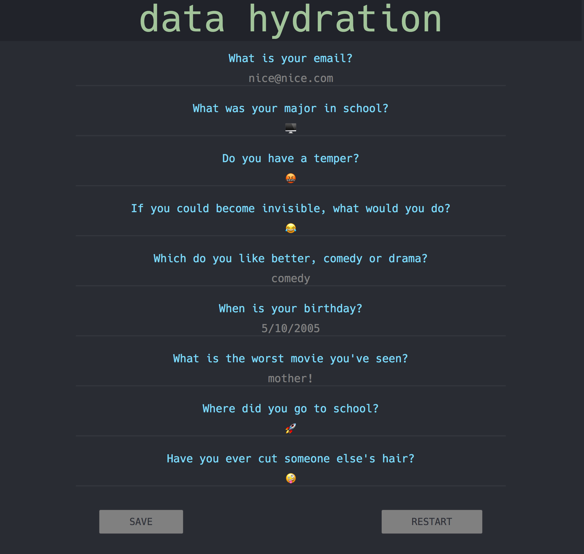

# Data Hydration w/ React and Redux - ReactJS Phoenix Talk - January 10, 2018

This is a small random form generator app that automatically pesists the user's redux state to redis to illustrate data hydration with React/Redux. 

## Setup:
Make sure you install Redis and start it with something like:
```
$ brew install redis
$ launchctl load ~/Library/LaunchAgents/homebrew.mxcl.redis.plist

```

make sure you have `yarn` and `node LTS` installed as well

```
$ yarn
$ yarn dev
```

now head to `localhost:3000` and play around with some data hydration!

